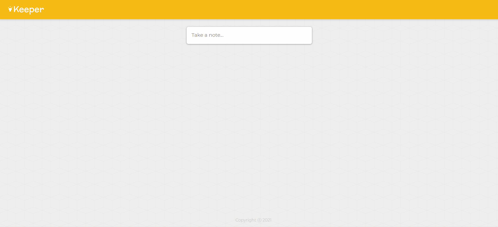

# Keeper App
Project part of the course The Complete 2021 Web Development Bootcamp from Dr. Angela Yu (The App Brewery) - Udemy. I improved the app making possible for the note editor to go back to its initial state once a note is submitted. 

## Objective
To develop expecience with React.js.

## Tecnologies Used
* HTML
* CSS
* JavaScript
* React.js

## What I learned
With this project I was able to practice my recently learned skills in React.js, such as React Components, React Props, map, filter, useState, conditional rendering, object and array destructuring, event handling and spread operator.

## Beyond the course's project
I improved the app making possible for the note editor to go back to its initial state once a note is submitted.

## Demo

